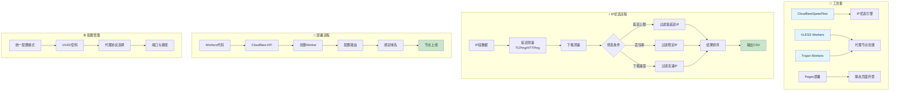
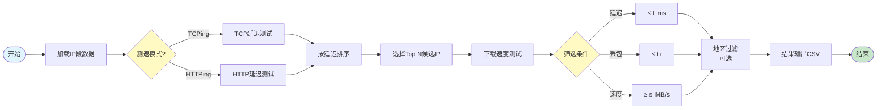

# ☁️ fork-cvwt - Cloudflare Workers工具集


## 📖 项目简介

fork-cvwt是Cloudflare Workers和Pages节点部署工具,提供VLESS/Trojan代理节点创建、IP优选、自动化部署等功能。

## 📦 项目来源

- **原项目**: 未知(待确认)
- **原作者**: 未知
- **开源协议**: 未明确标注(需查看原项目)
- **Fork时间**: 2024年

## 🔧 二次开发内容

本项目为原项目的学习研究版本,主要用于:
- 学习Cloudflare Workers的部署方法
- 研究IP优选算法的实现
- 了解代理协议的配置和管理

## ⚠️ 免责声明

本项目仅供学习研究使用,请勿用于非法用途。使用本项目所产生的一切后果由使用者自行承担。

## 系统架构 | System Architecture



## 优选IP算法流程 | IP Optimization Flow




优选工具使用CloudflareSpeedTest，用法如下：

``` cvs


参数：
    -n 200
        延迟测速线程；越多延迟测速越快，性能弱的设备 (如路由器) 请勿太高；(默认 200 最多 1000)
    -t 4
        延迟测速次数；单个 IP 延迟测速的次数；(默认 4 次)
    -dn 10
        下载测速数量；延迟测速并排序后，从最低延迟起下载测速的数量；(默认 10 个)
    -dt 10
        下载测速时间；单个 IP 下载测速最长时间，不能太短；(默认 10 秒)
    -tp 443
        指定测速端口；延迟测速/下载测速时使用的端口；(默认 443 端口)
    -url https://cf.xiu2.xyz/url
        指定测速地址；延迟测速(HTTPing)/下载测速时使用的地址，默认地址不保证可用性，建议自建；

    -httping
        切换测速模式；延迟测速模式改为 HTTP 协议，所用测试地址为 [-url] 参数；(默认 TCPing)
        注意：HTTPing 本质上也算一种 网络扫描 行为，因此如果你在服务器上面运行，需要降低并发(-n)，否则可能会被一些严格的商家暂停服务。
        如果你遇到 HTTPing 首次测速可用 IP 数量正常，后续测速越来越少甚至直接为 0，但停一段时间后又恢复了的情况，那么也可能是被 运营商、Cloudflare CDN 认为你在网络扫描而 触发临时限制机制，因此才会过一会儿就恢复了，建议降低并发(-n)减少这种情况的发生。
    -httping-code 200
        有效状态代码；HTTPing 延迟测速时网页返回的有效 HTTP 状态码，仅限一个；(默认 200 301 302)
    -cfcolo HKG,KHH,NRT,LAX,SEA,SJC,FRA,MAD
        匹配指定地区；地区名为当地机场三字码，英文逗号分隔，支持小写，支持 Cloudflare、AWS CloudFront，仅 HTTPing 模式可用；(默认 所有地区)

    -tl 200
        平均延迟上限；只输出低于指定平均延迟的 IP，各上下限条件可搭配使用；(默认 9999 ms)
    -tll 40
        平均延迟下限；只输出高于指定平均延迟的 IP；(默认 0 ms)
    -tlr 0.2
        丢包几率上限；只输出低于/等于指定丢包率的 IP，范围 0.00~1.00，0 过滤掉任何丢包的 IP；(默认 1.00)
    -sl 5
        下载速度下限；只输出高于指定下载速度的 IP，凑够指定数量 [-dn] 才会停止测速；(默认 0.00 MB/s)

    -p 10
        显示结果数量；测速后直接显示指定数量的结果，为 0 时不显示结果直接退出；(默认 10 个)
    -f ip.txt
        IP段数据文件；如路径含有空格请加上引号；支持其他 CDN IP段；(默认 ip.txt)
    -ip 1.1.1.1,2.2.2.2/24,2606:4700::/32
        指定IP段数据；直接通过参数指定要测速的 IP 段数据，英文逗号分隔；(默认 空)
    -o result.csv
        写入结果文件；如路径含有空格请加上引号；值为空时不写入文件 [-o ""]；(默认 result.csv)

    -dd
        禁用下载测速；禁用后测速结果会按延迟排序 (默认按下载速度排序)；(默认 启用)
    -allip
        测速全部的IP；对 IP 段中的每个 IP (仅支持 IPv4) 进行测速；(默认 每个 /24 段随机测速一个 IP)

    -c  
        按国家代码分类输出文件
    -cc 
        指定国家代码选择IP，仅支持 IPv4；(默认 所有国家)    
    -v
        打印程序版本 + 检查版本更新
    -h
        打印帮助说明
```
工具代码来自于:   https://github.com/XIU2/CloudflareSpeedTest  
我这个在此基础上做了功能增强修改。  

vless workers代码来自于:  https://github.com/3Kmfi6HP/EDtunnel   
trojan workers代码来自于：https://github.com/ca110us/epeius   
在原来代码基础上做了简单修改，统一了配置习惯。  


## License

The GPL-3.0 License.
